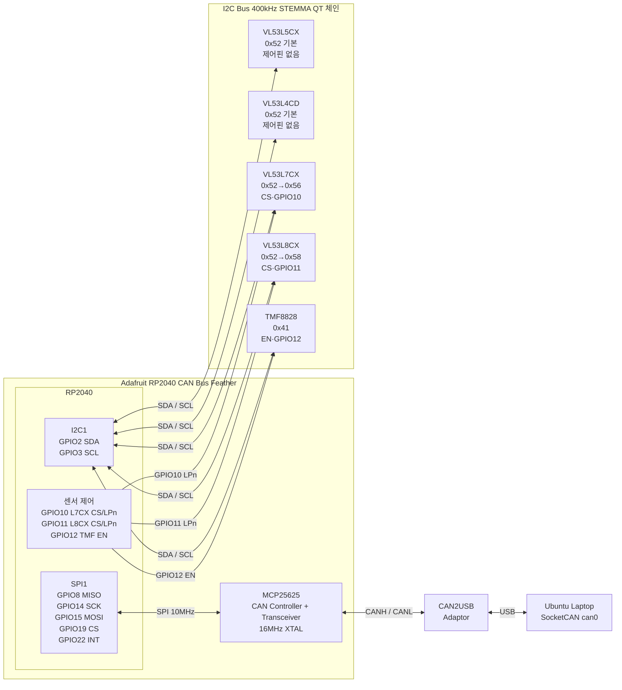

# ToF to CAN 배선 회로도

## 시스템 구성



## 핀 할당 요약

### RP2040 ↔ MCP25625 (보드 내장, PCB 고정)

| RP2040 GPIO | 기능 |
|------------|------|
| GPIO8  | SPI1 MISO |
| GPIO14 | SPI1 SCK |
| GPIO15 | SPI1 MOSI |
| GPIO19 | SPI1 CS |
| GPIO22 | INT (수신 인터럽트) |
| GPIO18 | RESET |
| GPIO16 | Standby |

### RP2040 ↔ ToF 센서

| RP2040 GPIO | 기능 | 연결 대상 |
|------------|------|---------|
| GPIO2  | I2C1 SDA    | STEMMA QT → 전체 센서 체인 |
| GPIO3  | I2C1 SCL    | STEMMA QT → 전체 센서 체인 |
| GPIO10 | CS / LPn    | VL53L7CX (I2C 모드 = LPn) |
| GPIO11 | CS / LPn    | VL53L8CX (I2C 모드 = LPn) |
| GPIO12 | EN          | TMF8828 |

### I2C 주소 할당

| 센서 | 최종 주소 | 비고 |
|------|---------|------|
| VL53L5CX **또는** VL53L4CD | 0x52 | 한 번에 하나만 연결, 부팅 시 Model ID로 자동 판별 |
| VL53L7CX | 0x56 | 기본 0x52 → LPn 제어로 재할당 |
| VL53L8CX | 0x58 | 기본 0x52 → LPn 제어로 재할당 |
| TMF8828  | 0x41 | 기본값 그대로 사용 |

## 부팅 시 센서 자동 감지 시퀀스

```
1. GPIO10=LOW, GPIO11=LOW  → L7CX, L8CX I2C 버스에서 숨김
2. I2C 스캔 → 0x52 응답 확인
   ├─ 응답 있음 → reg 0x010F 읽기
   │   ├─ 0xF0 → VL53L5CX 로 등록
   │   ├─ 0xEB → VL53L4CD 로 등록
   │   └─ 오류  → 두 센서 동시 연결 감지, 경고 출력
   └─ 응답 없음 → 0x52 센서 미연결
3. 0x41 응답 확인 → TMF8828 등록
4. GPIO10=HIGH → L7CX 나타남 → 0x56 으로 재할당
5. GPIO11=HIGH → L8CX 나타남 → 0x58 으로 재할당
```

## 주의사항

- VL53L7CX / VL53L8CX의 "CS 핀"은 I2C 모드에서 LPn(Low Power n) 으로 동작
  - LPn LOW: 센서 저전력 상태, I2C 무응답 → 주소 재할당 시 버스 격리에 활용
  - LPn HIGH: 정상 동작
- VL53L5CX 와 VL53L4CD 는 제어 핀 미연결 → 동시 연결 불가 (I2C 0x52 충돌)
- STEMMA QT 체인 순서: L5CX ↔ L4CD ↔ L7CX ↔ L8CX ↔ TMF8828
- FEATHER 내부 SPI 배선은 PCB에 고정 (외부 배선 불필요)
- MCP25625 크리스탈: 16MHz → CAN 비트레이트 설정 시 `MCP_CNF*_500K_16MHZ` 사용
